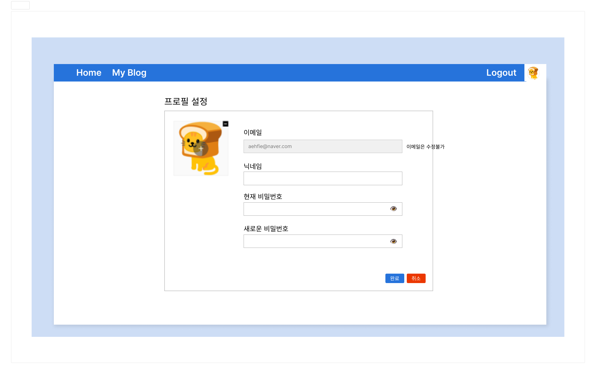
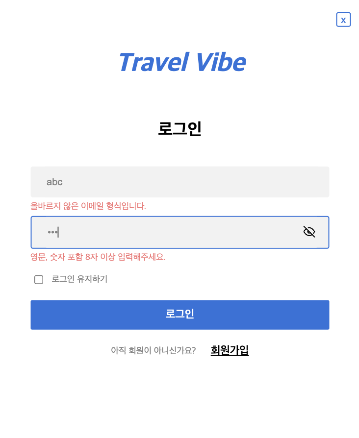
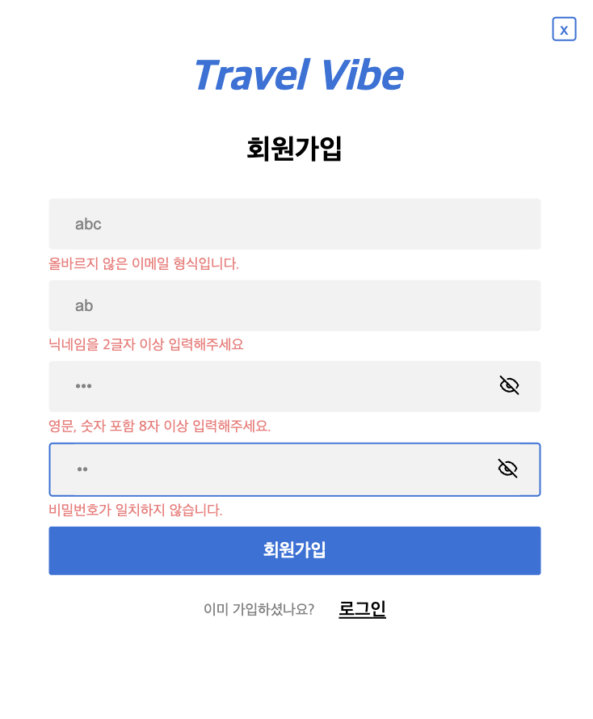
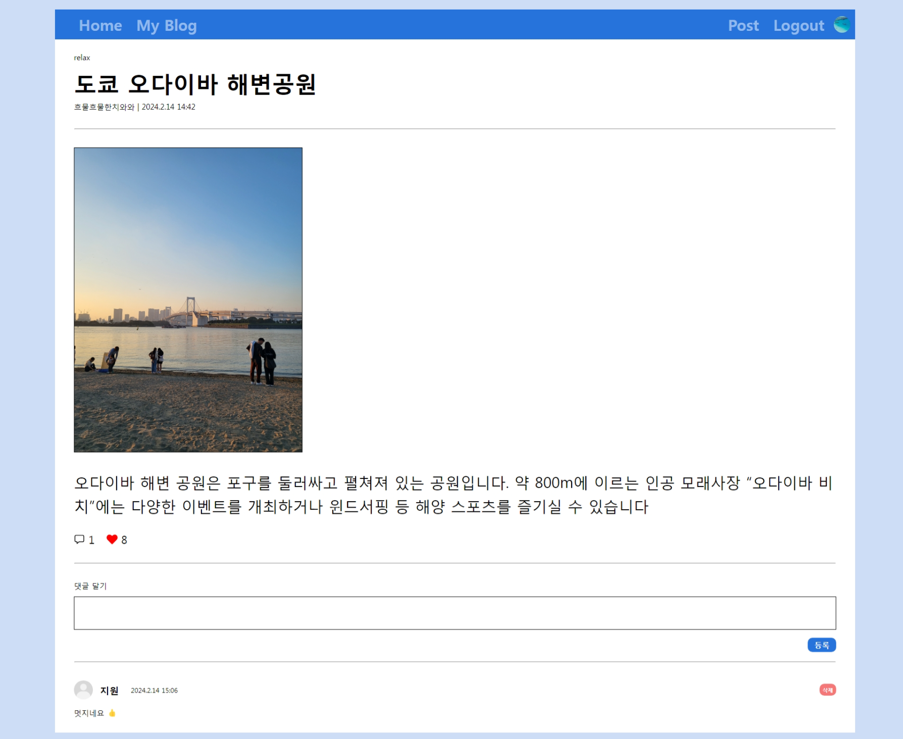
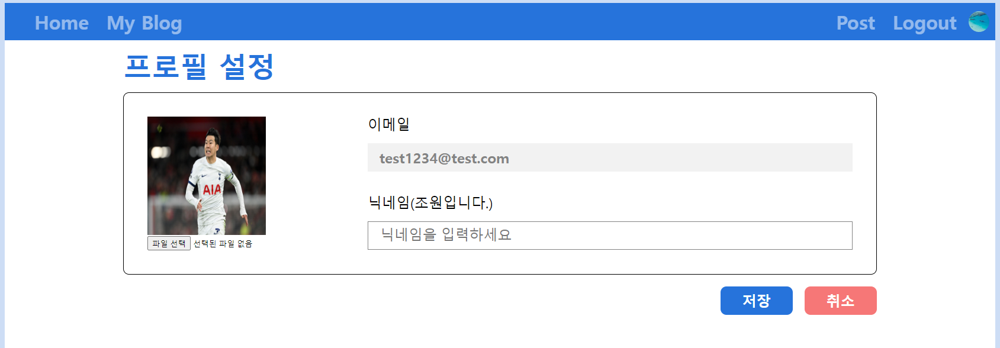
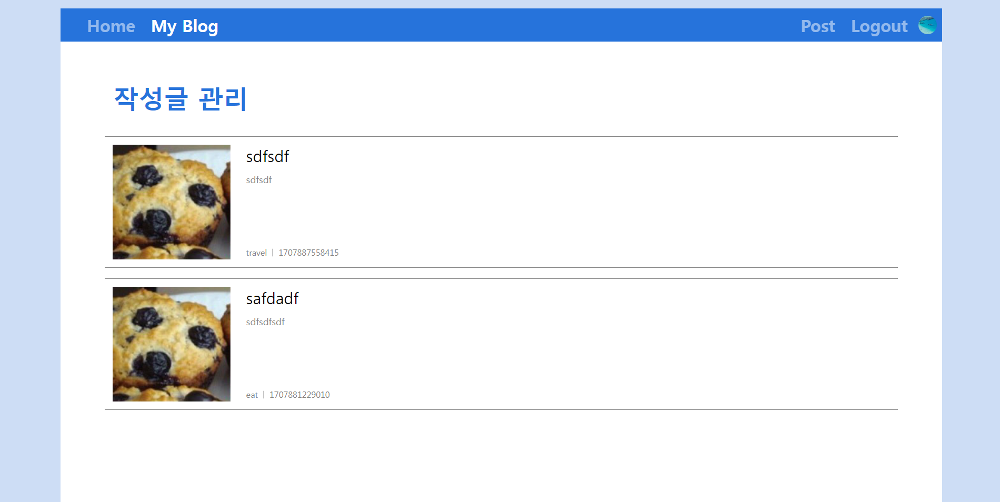

# Travel Vibe 🏖️

React를 이용한 여행 컨셉의 블로그 플랫폼 만들기

<br>

### 🔽 **프로젝트 소개**

**프로젝트명** : Travel Vibe

**개발 기간** : 2024.02.07 ~ 2024.02.14(4일간)

**프로젝트 소개** : 여행 컨셉의 블로그 플랫폼으로 각 카테고리에 따라 여행에 관련된 글을 쓰고, 공유할 수 있는 블로그 플랫폼 입니다.

**배포 주소** : https://nbc-travel-vibe.vercel.app/

<br>

### 🔽 **팀원 소개**

|                                                             신서연                                                              |                                                              유한빈                                                              |                                                               김승희                                                               |                                                              곽인해                                                              |                                                              서지원                                                              |
| :-----------------------------------------------------------------------------------------------------------------------------: | :------------------------------------------------------------------------------------------------------------------------------: | :--------------------------------------------------------------------------------------------------------------------------------: | :------------------------------------------------------------------------------------------------------------------------------: | :------------------------------------------------------------------------------------------------------------------------------: |
| <p align="center"></p> | <p align="center"></p> | <p align="center"></p> | <p align="center"></p> | <p align="center"></p> |
|                                        [@seoyeon-1206](https://github.com/seoyeon-1206)                                         |                                           [@picoloman6](https://github.com/picoloman6)                                           |                                          [@HuaHuaChiChi](https://github.com/HuaHuaChiChi)                                          |                                              [@innes-k](https://github.com/innes-k)                                              |                                             [@seopport](https://github.com/seopport)                                             |
|                                                              리더                                                               |                                                               팀원                                                               |                                                                팀원                                                                |                                                               팀원                                                               |                                                               팀원                                                               |
|                                                           마이페이지                                                            |                                              게시물 페이지 , redux, firebase, 배포                                               |                                                        게시물 작성, Storage                                                        |                                             로그인 및 회원가입 모달, Authentication                                              |                                                  메인페이지, 게시물 관리 페이지                                                  |

<br>

### 🔽 **개발 환경**

- **Environment :** vscode, github
- **Development :** React, Javascript
- **Database :** Firebase Firestore, Firebase Storage
- **Library :** redux, react-router-dom, styled-components, react-icons, dotenv
- **Design :** Figma
- **Login :** Firebase Authentication
- **Deployment :** Vercel

<br>

### **🔽 시작 가이드**

**1. git clone**

```bash
$ git clone https://github.com/picoloman6/nbc_travel_vibe.git
$ cd nbc_travel_vibe
```

**2. Firebase 환경변수 설정**


**3. npm start**

```bash
npm i
npm start
```

<br>

### **🔽 와이어프레임**

|                                   메인 페이지 - 로그아웃시                                   |                                            메인 페이지 - 로그인시                                            |
| :------------------------------------------------------------------------------------------: | :----------------------------------------------------------------------------------------------------------: |
|  |                      |
|                                       **로그인 모달**                                        |                                              **회원가입 모달**                                               |
|                                                    |                                                                |
|                                      **글 작성 페이지**                                      |                                                **마이페이지**                                                |
|                                            |                                                                        |
|                                      **게시물 페이지**                                       |                                            **게시글 관리 페이지**                                            |
|                                                |  |

<br>

### **🔽 DB ERD**


<br>

### 🔽 화면 구성 및 기능

#### 1. 메인 페이지

| 메인 페이지                               | 로그인 모달                                  | 회원가입 모달                                  |
| ----------------------------------------- | -------------------------------------------- | ---------------------------------------------- |
|  |  |  |

#### 1.1. 로그인 및 회원가입

|                   로그인 화면                   |                    회원가입 화면                    |
| :---------------------------------------------: | :-------------------------------------------------: |
|  |  |

- 로그인

  - 헤더의 로그인을 눌러 로그인을 할 수 있습니다.
  - 로그인을 누르면 모달창이 뜨고, 이메일과 비밀번호를 입력하고 로그인합니다.
  - 각 입력란에 대한 유효성 검사로 조건에 부합하는 값을 입력해야 합니다.

- 회원가입

  - 로그인 정보가 없을 시 '회원 가입'을 눌러 회원을 등록할 수 있습니다.
  - 이메일과 닉네임, 비밀번호를 입력하고 회원가입합니다.
  - 각 입력란에 대한 유효성 검사로 조건에 부합하는 값을 입력해야 합니다.

- 로그인이 되지 않았을 때는 Post와 My Blog 기능을 사용할 수 없습니다.
- 로그인 했을 시에는 로그아웃 버튼을 눌러 로그아웃할 수 있습니다.

**1.2. 카테고리 탭**

- 각 카테고리에 올라온 글을 카테고리 탭에서 선별하여 조회할 수 있습니다.
- All을 누르면 모든 카테고리의 글을 조회합니다.

**1.3. 게시글 프리뷰**

- 게시글 내용 일부를 프리뷰를 통해 확인할 수 있습니다.
- 하단의 조회수와 댓글수, 좋아요수를 통해 게시글의 통계를 확인할 수 있습니다.
- 게시글을 누르면 게시물 상세 페이지로 이동합니다.

<br>

#### 2. 게시물 페이지

|  |
| ------------------------------------------- |

- 게시물의 상세 내용을 조회할 수 있습니다.
- 게시물을 수정, 삭제할 수 있습니다.
- 하트 버튼을 눌러 게시글에 좋아요를 표시할 수 있습니다.
- 댓글을 작성하고 등록을 눌러 댓글을 추가할 수 있습니다.
- 등록 한 댓글은 삭제 버튼을 눌러 삭제할 수 있습니다.
- 게시글 수정 및 삭제
  - 현재 사용자가 게시물을 작성한 사용자인 경우에만 수정 및 삭제 버튼이 표시됩니다.
- 댓글 삭제
  - 현재 사용자가 댓글을 작성한 사용자인 경우에만 삭제 버튼이 표시됩니다.

<br>

#### 3. 글 작성하기

|  |
| ----------------------------------------- |

- 헤더의 Post 버튼을 눌러 글을 작성할 수 있습니다.
- 지정할 카테고리를 선택합니다.
- 사진 등록하기를 눌러 사진을 등록할 수 있습니다.
  - 사진을 등록하면 회색 칸에 보여지게 되고, 사진을 클릭하면 확대하여 볼 수 있습니다.
- 제목과 내용을 입력하고 등록 버튼을 눌러 게시글을 등록할 수 있습니다.

<br>

#### 4. 마이페이지

|  |
| ----------------------------------------- |

- 헤더의 프로필 이미지를 눌러 마이페이지로 이동할 수 있습니다.
- 마이페이지에서는 닉네임과 프로필 사진을 수정할 수 있습니다.
  - 수정할 닉네임을 입력하고 수정할 사진을 첨부한 뒤 완료를 눌러 수정을 완료합니다.
  - 취소 버튼을 누르면 이전 페이지로 돌아갑니다.

<br>

#### 5. 게시글 관리 페이지

|  |
| ----------------------------------------------- |

- 헤더의 My Blog를 눌러 자신이 쓴 게시글들을 확인할 수 있습니다.
- 게시글을 누르면 해당 게시글 페이지로 이동합니다.

<br>

### 🚦트러블 슈팅

<details>
<summary>1. firestore collection() 참조 오류</summary>
<div>

- 에러 메시지 : `FirebaseError: Expected first argument to collection() to be a CollectionReference`

- 원인 : collection을 참조하면서 where함수를 따로 호출하면서 생긴 오류
  ```
  const usersRef = (collection(db, 'users'), where('email', '==', email));
  ```
- 해결 : Firestore에서 쿼리를 생성할 때, collection() 함수와 where() 함수를 따로 호출하는 대신 query() 함수를 사용하여 컬렉션과 쿼리를 동시에 정의해야 함
  ```
  const usersRef = query(
      collection(db, 'users'),
      where('email', '==', email)
    );
  ```

</div>
</details>

<details>
  <summary style="font-weight: bold;">2. NavLink isActive 스타일 적용 문제</summary>
  <div markdown="1">
    
 - **문제 :** 헤더 부분에서 Navlink를 사용하여 활성 상태에 따라 스타일을 적용하려 했으나, 현재 페이지의 URL이 NavLink의 to값과 일치함에도 isActive의 상태에 따라 지정한 스타일이 올바르게 작동되지 않는 문제가 발생했습니다.

- **시도 :**

  1. isActive props를 넘겨줄 때 path 비교 로직 추가하기

     ```jsx
     opacity: ${(props) => props.$isActive ? '100%' : '50%'};
     ```

     $isActive prop을 받아와서 isActive 상태로 스타일을 제어하려고 했으나, opacity가 계속해서 100%로 적용되었습니다.

     ```jsx
     $isActive={pathName==='/경로'}
     ```

     이 경우 useLocation으로 path를 받아와서 NavLink isActive props에 현재 path와 비교하는 로직을 추가하여 해결할 수 있었습니다.

  2. 클래스 선택자 사용하기

     props를 넘겨받는 방식이 아닌 .active 클래스 선택자를 사용하여 스타일을 변경하도록 하니 정상 작동하였습니다.

     ```jsx
     &.active {
         opacity: 100%;
       }
     ```

- **해결방안**: Navlink에 $isActive prop을 넘겨주는 대신에 &.active 선택자를 사용하여 스타일을 지정하는 방법으로 문제를 해결했습니다. Navlink가 활성 상태일 때 자동으로 '.active' 클래스를 부여하므로, isActive prop을 따로 제어할 필요가 없었습니다. 이 방법을 통해 active 상태에 따라 스타일을 지정할 수 있었습니다.
